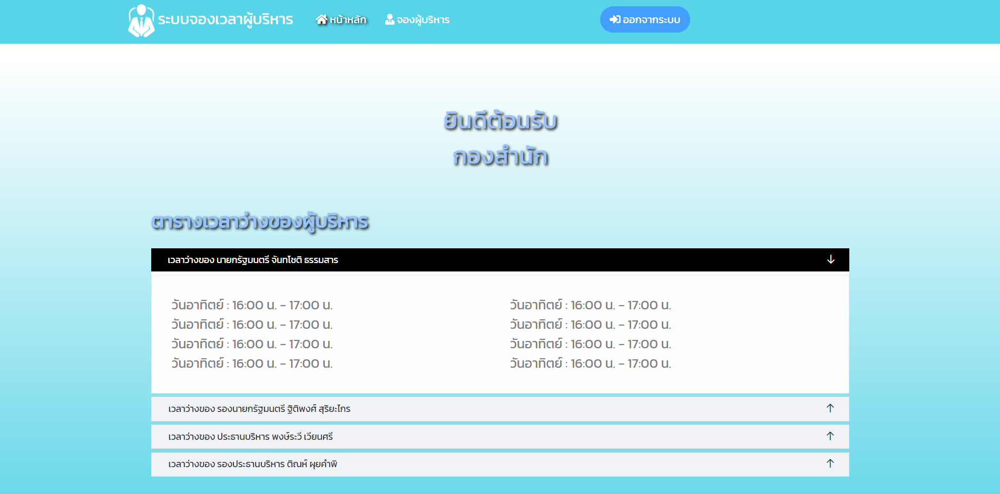
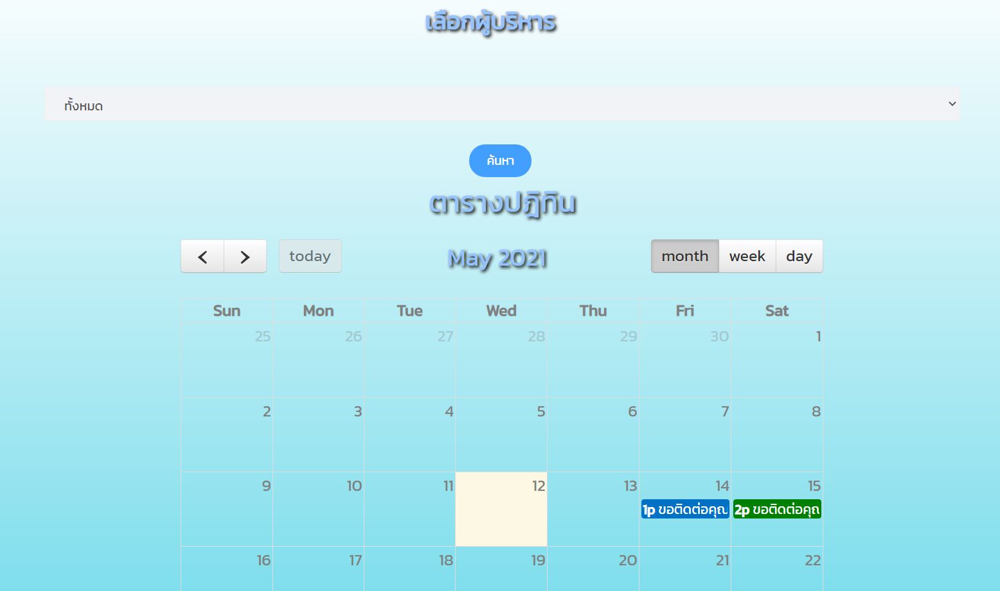
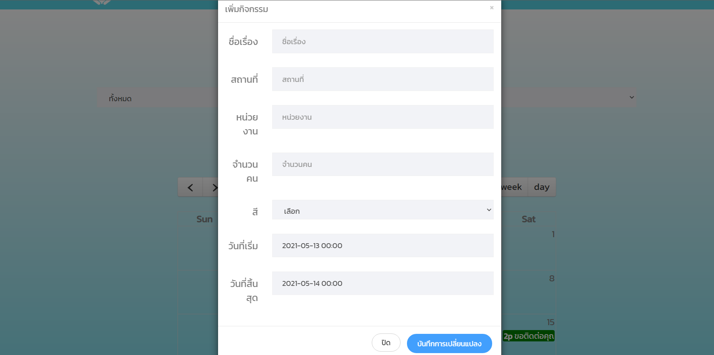
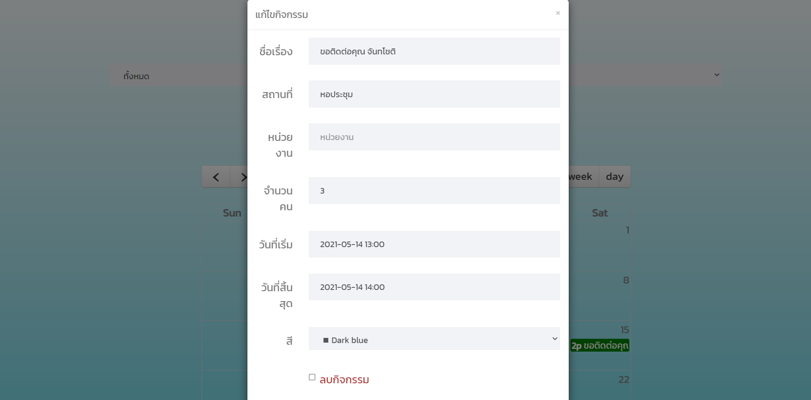
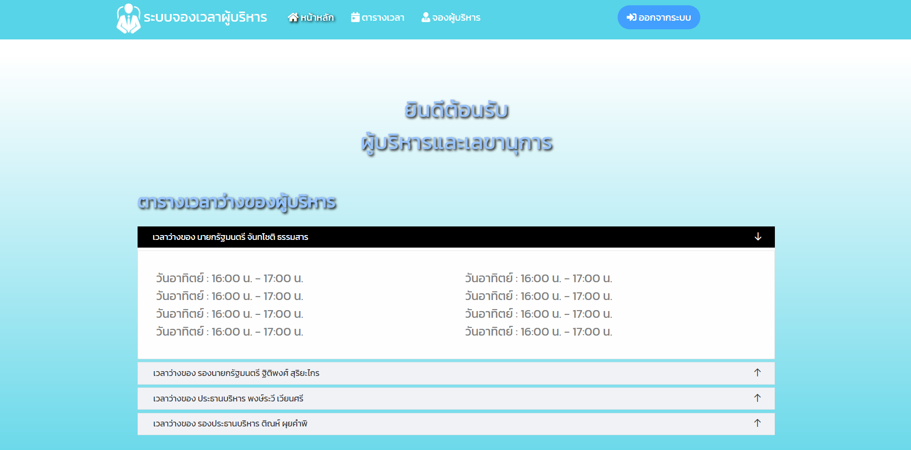
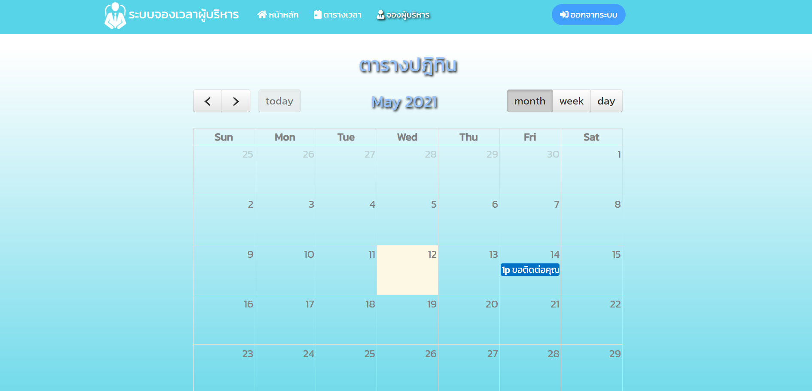

# เว็บไซต์ระบบจองเวลาผู้บริหาร

เว็บไซต์ระบบจองเวลาผู้บริหาร คือเว็บไซต์จัดเวลาการจองผู้บริหารเพื่อให้ผู้ใช้งานเข้ามาจองได้ในกรณีที่ต้องการให้ผู้บริหารเข้าร่วมงาน เช่น จองเวลาให้ผู้บริหารเข้าร่วมงานแต่งงาน ไปเปิดงานเทศกาลต่างๆ

## Tools

- PHP
- MySQL
- JavaScript

## Installation

1. Dump Database **calendar.sql** ในโฟลเดอร์ **database** ลงใน PHPMyadmin
2. นำโฟลเดอร์หลักไปไว้บน Server

## หน้าจอการทำงานของเว็บไซต์

> หน้าแรก

  

> หน้าแรก (ต่อ)

  

> หน้าแรก (ต่อ)

  

> หน้าแรกเมื่อเข้าสู่ระบบเป็น User

  

> หน้าจองผู้บริหารสำหรับ User จะแสดงตารางปฏิทินของผู้บริหารทั้งหมด

  

> เมื่อกดที่วันที่จะเป็นการเพิ่มข้อมูลที่ต้องการนัด

  

> เมื่อกดดูข้อมูลที่วันที่จะแสดงรายละเอียด

  

> หน้าแรกเมื่อเข้าสู่ระบบเป็น Admin

  

> หน้าจองผู้บริหารสำหรับ Admin จะแสดงตารางปฏทินของเรา

  

